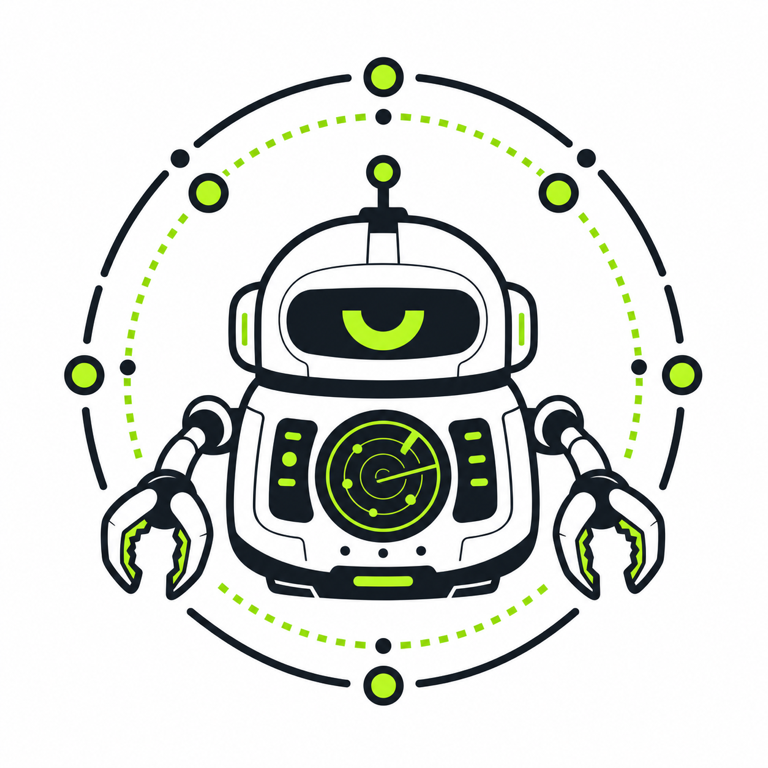
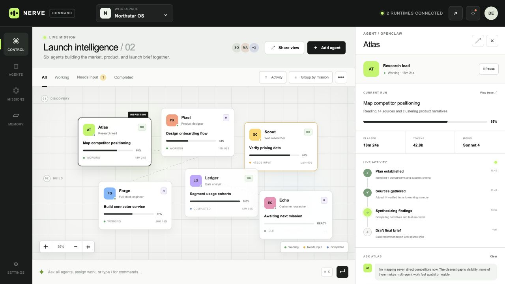
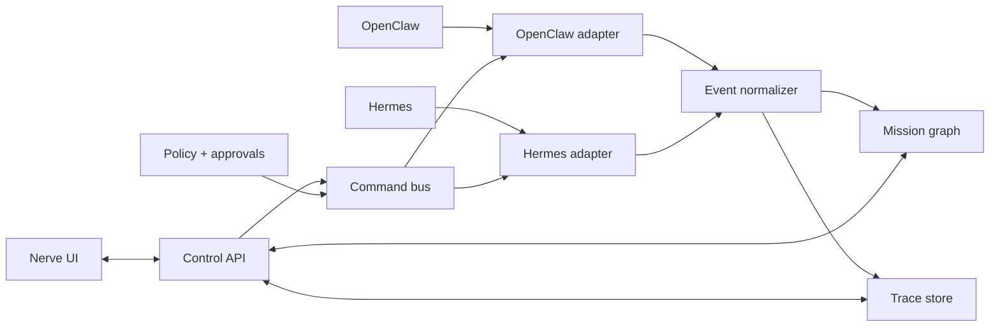

<p align="center">
  
</p>

<h1 align="center">Nerve</h1>

<p align="center">
  <strong>See every agent. Understand every run. Command the whole fleet.</strong>
</p>

<p align="center">
  An open-source visual command center for OpenClaw and Hermes agents.
</p>

<p align="center">
  <a href="https://github.com/boyeesu/nerve/actions/workflows/ci.yml"></a>
  <a href="LICENSE"></a>
  <a href="package.json"></a>
  <a href="docs/ROADMAP.md"></a>
</p>

<p align="center">
  <a href="#quickstart">Quickstart</a> ·
  <a href="#why-nerve">Why Nerve</a> ·
  <a href="docs/ARCHITECTURE.md">Architecture</a> ·
  <a href="docs/ADAPTERS.md">Adapter contract</a> ·
  <a href="docs/ROADMAP.md">Roadmap</a> ·
  <a href="CONTRIBUTING.md">Contributing</a>
</p>

<p align="center">
  
</p>

> [!IMPORTANT]
> Nerve is a public-alpha, single-operator control plane. Live Hermes HTTP and
> OpenClaw Gateway adapters, encrypted connections, commands, skill management,
> PostgreSQL persistence, audit events, and Railway packaging are implemented.
> Runtime compatibility is not guaranteed until `v1.0`.

## Why Nerve

Agent runtimes are good at running agents. They are not always the best place
to understand a whole organization of agents at once.

Nerve sits above individual runtimes and gives operators one legible surface:

- a spatial map of agents, missions, handoffs, and dependencies;
- a live view of what each agent is doing and why it needs attention;
- one conversation layer across OpenClaw and Hermes;
- fleet-wide commands with explicit approval and audit boundaries;
- runtime-neutral traces, metrics, artifacts, and memory references.

The goal is not to replace agent runtimes. It is to make operating many of them
calm, observable, and safe.

## What works today

- Unified OpenClaw and Hermes agent map
- Server-side OpenClaw Gateway protocol-v4 connection and agent discovery
- Server-side Hermes API connection, capabilities, runs, stop, and approvals
- Working, waiting, completed, and idle states
- Agent filtering and canvas zoom
- Run inspection with progress, trace, model, token, and timing data
- Direct commands and stop controls with idempotency records
- Direct operator-to-agent questions that start runtime-native work
- OpenClaw ClawHub skill installation per agent
- Hermes installed-skill discovery and Nerve-side assignment
- Encrypted credentials, authenticated APIs, endpoint SSRF policy, and audits
- PostgreSQL migrations and production health checks
- Fleet-wide command bar
- Responsive layouts for desktop and smaller screens

The dashboard falls back to sample agents until a live runtime is connected.
See [Connecting runtimes](docs/CONNECTIONS.md) for supported APIs and network
requirements.

## Quickstart

### Requirements

- Node.js 22.13 or newer
- npm 10 or newer
- PostgreSQL 15 or newer

### Run locally

```bash
git clone https://github.com/boyeesu/nerve.git
cd nerve
npm install
cp .env.example .env.local
```

Fill `DATABASE_URL`, `NERVE_ENCRYPTION_KEY`, `NERVE_SESSION_SECRET`, and
`NERVE_ADMIN_TOKEN`, then initialize and run:

```bash
npm run db:migrate
npm run dev:next
```

Open the local URL and unlock Nerve with `NERVE_ADMIN_TOKEN`.

### Deploy on Railway

Nerve includes a Docker image, config-as-code, pre-deploy migrations, a
PostgreSQL service contract, and readiness checks. Follow the
[Railway deployment guide](docs/RAILWAY.md).

### Validate a change

```bash
npm run build
node --test tests/rendered-html.test.mjs
npm run lint
```

## How it fits together



Nerve treats each runtime as an adapter behind a shared model for agents,
runs, events, messages, commands, approvals, and artifacts. Read
[Architecture](docs/ARCHITECTURE.md) for system boundaries and
[Adapter contract](docs/ADAPTERS.md) for the proposed integration interface.

## Project status

| Area | Status |
| --- | --- |
| Product interface | Live connection-aware alpha |
| Connection persistence | PostgreSQL + encrypted credentials |
| OpenClaw adapter | Protocol-v4 subset; pairing, agents, commands, skills |
| Hermes adapter | HTTP API; capabilities, runs, actions, skills |
| Live event transport | Poll/request foundation; durable streaming planned |
| Authentication | Single-operator secure session |
| Tenancy and RBAC | Planned |
| Policy engine | Runtime approvals supported; central policy planned |

No production compatibility promise is made before `v1.0.0`. Breaking changes
will be documented in [CHANGELOG.md](CHANGELOG.md).

## Documentation

| Document | Purpose |
| --- | --- |
| [Architecture](docs/ARCHITECTURE.md) | System boundaries, services, data flow, safety, and deployment |
| [Adapter contract](docs/ADAPTERS.md) | Runtime-neutral types, events, capabilities, and commands |
| [Connecting runtimes](docs/CONNECTIONS.md) | OpenClaw/Hermes setup, pairing, scopes, and network access |
| [Production readiness](docs/PRODUCTION.md) | Implemented controls and remaining stable-release gates |
| [Railway deployment](docs/RAILWAY.md) | Docker, PostgreSQL, variables, health checks, and template definition |
| [Development](docs/DEVELOPMENT.md) | Setup, project layout, testing, and local workflows |
| [Roadmap](docs/ROADMAP.md) | Milestones from prototype to stable release |
| [Governance](GOVERNANCE.md) | Decision-making, roles, and project stewardship |
| [Contributing](CONTRIBUTING.md) | How to propose, build, test, and submit changes |
| [Security](SECURITY.md) | Supported versions and responsible disclosure |
| [Support](SUPPORT.md) | Where to ask questions and report problems |
| [Code of Conduct](CODE_OF_CONDUCT.md) | Community participation standards |

## Contributing

Contributions are welcome, especially around runtime adapters, event
normalization, observability, accessibility, and operator safety.

Start with [CONTRIBUTING.md](CONTRIBUTING.md), review the
[architecture](docs/ARCHITECTURE.md), and use the repository issue forms before
beginning a large change.

## Security

Please do not report vulnerabilities in public issues. Follow the private
disclosure process in [SECURITY.md](SECURITY.md).

## License

Nerve is available under the [MIT License](LICENSE).
