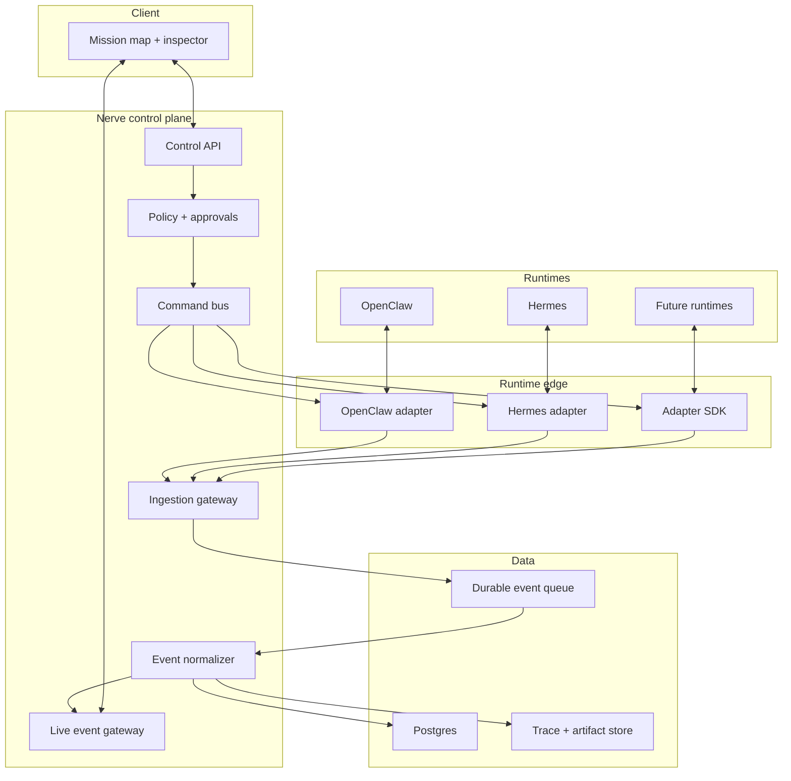

# Architecture

This document describes the intended production architecture for Nerve.
The current repository implements the product interface and a simulated domain
model; backend services and runtime adapters remain roadmap work.

## Goals

- Present many agent runtimes through one coherent operator model.
- Preserve runtime-specific capabilities without leaking them into the core.
- Stream useful summaries and state transitions without exposing private
  chain-of-thought.
- Make commands reversible, policy-aware, idempotent, and auditable.
- Support workspace isolation and least-privilege runtime credentials.

## Non-goals

- Replacing OpenClaw, Hermes, or their native orchestration.
- Reimplementing model inference.
- Persisting hidden reasoning.
- Pretending every runtime supports identical controls.
- Allowing the UI to issue arbitrary privileged commands without policy checks.

## System overview

## Components

### Runtime adapters

Adapters translate runtime-native state and commands into the shared contract.
They declare capabilities, verify webhook authenticity, redact sensitive data,
and provide idempotent command delivery.

See [ADAPTERS.md](ADAPTERS.md).

### Ingestion gateway

The gateway authenticates adapter traffic, applies workspace identity, rejects
replays, assigns an ingestion timestamp, and writes accepted events to a
durable queue.

### Event normalizer

The normalizer validates event envelopes, reconciles runtime ordering,
materializes current agent and run state, and fans out safe live updates.
Raw payloads should be retained only when configured and must follow redaction
and retention policy.

### Control API

The API serves workspaces, agents, missions, runs, trace summaries, artifacts,
and conversations. It never talks directly to a runtime; commands go through
policy and the command bus.

### Policy and approvals

Policy evaluates actor, workspace, runtime capability, requested command,
resource scope, and risk. Commands can be allowed, denied, or held for explicit
approval.

### Command bus

The bus persists every command before delivery, uses idempotency keys, records
acknowledgements, and retries only where the adapter declares safe retry
semantics.

### Live event gateway

The UI receives state deltas over WebSocket or Server-Sent Events. Clients
reconcile using monotonically increasing workspace cursors and can recover from
missed events through the Control API.

## Core domain model

| Entity | Responsibility |
| --- | --- |
| Workspace | Tenant, membership, policy, and runtime connections |
| Runtime connection | Adapter identity, version, health, and capabilities |
| Agent | Stable operator-facing identity for a runtime agent |
| Mission | Human-defined outcome grouping agents and runs |
| Run | One bounded execution of an agent task |
| Event | Immutable normalized observation about a run |
| Command | Requested state change sent to a runtime |
| Approval | Human or policy decision attached to a command |
| Message | Operator/agent conversation item |
| Artifact | File, link, report, code change, or structured output |

## Event flow

1. A runtime adapter observes a native event.
2. The adapter emits a signed, redacted, normalized envelope.
3. The ingestion gateway authenticates and durably accepts it.
4. The normalizer updates materialized state.
5. The live gateway publishes a safe delta.
6. The client reconciles the mission graph and inspector.

Events are at-least-once. Consumers must deduplicate by `event_id` and tolerate
out-of-order delivery using runtime sequence and observation timestamps.

## Command flow

1. An authenticated operator requests a command.
2. The Control API validates shape and workspace scope.
3. Policy returns allow, deny, or approval-required.
4. An allowed command is persisted with an idempotency key.
5. The adapter translates and delivers it.
6. Runtime acknowledgement and later state events complete the audit trail.

The UI must never represent an accepted command as completed until runtime
state confirms the transition.

## Data and privacy

- Store secrets only in an encrypted secrets service.
- Store safe summaries instead of hidden reasoning.
- Redact credentials and configured sensitive fields at the adapter boundary.
- Make trace and artifact retention configurable by workspace.
- Partition every query and event stream by workspace identity.
- Record access to sensitive artifacts.

## Reliability

- Durable ingestion before acknowledgement
- At-least-once event processing with deduplication
- Idempotent command delivery
- Dead-letter handling for invalid events
- Adapter health and lag metrics
- Client cursor recovery
- Explicit degraded and disconnected states

## Deployment

A production deployment can begin as a modular monolith:

- web and Control API;
- background normalizer and command worker;
- Postgres;
- durable queue;
- object storage for artifacts;
- WebSocket or SSE gateway.

Split services only when scale, failure isolation, or team ownership makes the
boundary valuable.

## Architectural decisions

Material decisions should be recorded as short Architecture Decision Records
under `docs/decisions/`. Each record should include context, decision,
consequences, and status.

